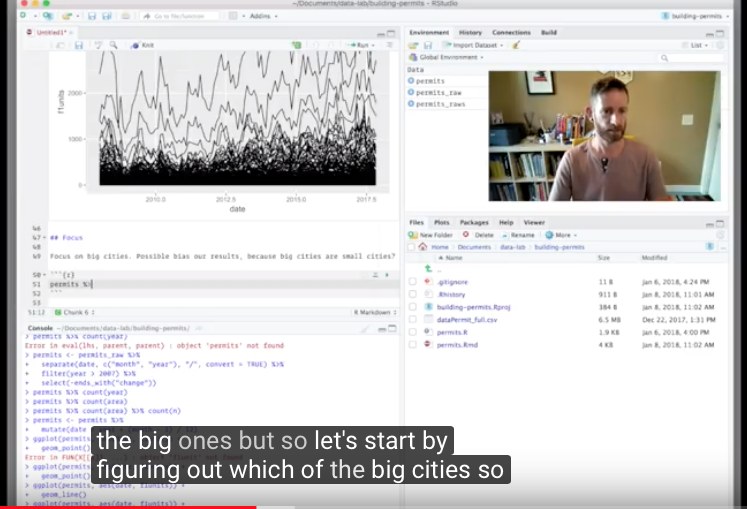

```{r setup, include=FALSE}
knitr::opts_chunk$set(collapse = TRUE)
```

### Watching an Expert at Work

Teaching Data Science is challenging since it involves teaching the entire data science analysis cycle.  While it's helpful for students to experience this process, they can often feel at sea in terms of the decisions they need to make and the iterative process of exploration, modeling, summarization.

We've been using the data science cycle promulgated by Hadley Wickham and Garrett Grolemund (both from RStudio) that was published in their excellent book: R for Data Science, https://r4ds.had.co.nz.


Back in 2018, Hadley recorded a video of his analysis of a dataset with the goal of demonstrating his workflow.  I've found this remarkably illuminating viewing and have incorporated this into my Introductory Data Science class.  I've shown the first five minutes or so of the video (https://www.youtube.com/watch?v=go5Au01Jrvs) then assigned the students to watch the remainder in the privacy of of their own room.  



I like one of the comments:

> Amazing to see Hadley's approach and thinking. We need more videos like this. It also shows even Hadley makes silly mistake so remember its ok to get frustrated.

I find this screencast really interesting for a number of reasons:

1. Hadley provides an oddly compelling stream of consciousness narrative (akin to a director's commentary on a movie) that helps to clarify *why* he's doing what he is doing
2. He makes mistakes (quite a few).  It's humorous when he forgets the calling structures for routines he's written.  But it's even more powerful that he shrugs off the mistake, corrects it, and moves forward.  He's a zen master of calm (see http://pamvictor.blogspot.com/2015/02/the-zen-of-improv-how-to-make-sweet.html for a lovely essay on how fear of making mistakes can paralyze us)
3. We learn some cool idioms and approaches to data wrangling and exploration
4. He's having so much fun diving into the dataset: it's wonderful to watch his unbridled excitement and his New Zealand accent.

So far I've only had the students watch the video.  Next time I might imagine having students explore an extension of the original data (https://github.com/hadley/building-permits) and communicate their results.  Or even more ambitiously, give students a dataset where I've done some preliminary work and have them record a five minute screencast.


### Learn more

- https://r4ds.had.co.nz
- https://www.youtube.com/watch?v=go5Au01Jrvs
- https://github.com/hadley/building-permits