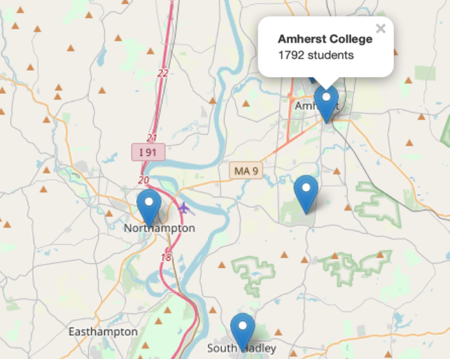

```{r setup, include=FALSE}
knitr::opts_chunk$set(collapse = TRUE)
```

# Leaflet for mapping

Maps are an important way of displaying data.  
The leaflet package in R provides access to the Leaflet Javascript libraries (http://leafletjs.com), an open-source mechanism to create interactive maps.  The leaflet package (https://rstudio.github.io/leaflet/) provides an interface within R that allows for composing maps using map tiles (e.g., from OpenStreetMap, https://www.openstreetmap.org/#map=5/38.007/-95.844) that can be annotated with markers, lines, popups.

Here's a simple example where data from higher education institutions from within the Five College Consortium in Western Massachusetts is mapped.

There are four steps:

1. Create the dataset that will be displayed
2. Create a map *widget* (according to Wikipedia, a component of an interface that enables a user to perform a function): here we call this `m`
3. Add layers and tiles
4. Print the map widget to see the results

```{r cars}
# step 1: create the dataset
institution <- c("Amherst College", "Hampshire College", "Mount Holyoke College",
                 "Smith College", "University of Massachusetts")
lat <- c(42.3709, 42.325079, 42.255586, 42.318119, 42.3912)
lng <- c(-72.5170, -72.530837, -72.574503, -72.638139, -72.5267)
students <- c(1792, 1175, 2255, 2600, 28635)
label <- paste0("<b>", institution, "</b><br>", students, " students", sep="")
ds <- dplyr::tibble(institution, lat, lng, students, label)
dplyr::glimpse(ds)
```

Here we have used simple html markup to create a two line label, with institution bolded, that will be displayed.

```{r}
# steps 2-3: generate leaflet map 
library(leaflet)
m <- leaflet(ds) %>% 
  addTiles() %>% 
  addMarkers(~lng, ~lat, popup = ~ label)
m # step 4: display the results
```
The popups for each of the five institutions can be clicked to see information contained in the `label` variable.  Here's an example of what happens if Amherst College is clicked:



### Notes

MORE INFORMATION: The RStudio leaflet webpage (https://rstudio.github.io/leaflet/) has more details about the following topics: The Map Widget, Basemaps, Markers, Popups and Labels, Lines and Shapes, GeoJSON and TopoJSON, Raster Images, Shiny Integration, Colors, Legends, Show/Hide Layers, Choropleths, Projections, and Additional Features.

HTML OUTPUT: Because of the interactive nature of the underlying JavaScript library, leaflet maps created within an R Markdown file can't be rendered to pdf or Microsoft Word.  If you try, you will see the following error message:

> Error: Functions that produce HTML output found in document targeting latex output.
Please change the output type of this document to HTML. Alternatively, you can allow
HTML output in non-HTML formats by adding this option to the YAML front-matter of
your rmarkdown file:

> always_allow_html: yes

> Note however that the HTML output will not be visible in non-HTML formats.


### Learn more

- https://rstudio.github.io/leaflet/
- https://leafletjs.com
- http://shiny.rstudio.com/gallery/superzip-example.html
